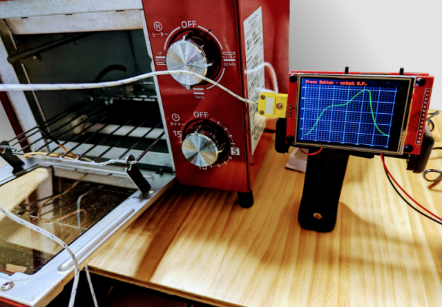

# トースターリフローコントローラ
> __Warning__
>
> 内容には当方がおこなった「家電の改造行為」が含まれています、実際の改造はすべて各自の責任においておこなってください。
>
> 何がおきても当方は一切責任を負いません。
>
> リフローしたトースターで調理しないでください。
>
> 健康被害が発生するおそれがあります。

## これは何？

トースターをリフロー炉に改造するプロジェクトです。

SSRを使用し、PID制御で温度を調節します。

## ドキュメント

* [ハードウェア資料](./doc/hardware.md)

* [ソフトウェア資料](./doc/software.md)

* [ソ－スコード](./reflow)

