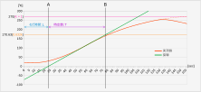

# PID パラメータ

> __Warning__
>
> 内容には当方がおこなった「家電の改造行為」が含まれています、実際の改造はすべて各自の責任においておこなってください。
>
> 何がおきても当方は一切責任を負いません。
>
> リフローしたトースターで調理しないでください。
>
> 健康被害が発生するおそれがあります。

## PID パラメータの求め方

Reference : [https://taketake2.com/K5.html](https://taketake2.com/K5.html)

トースターの温度特性の測定で保存したデータからPIDのパラメータであるKp、Ki、Kdを求めます。

求めた値はぴったりになることはまれなので、それをもとに微調整してください。

今回使用したトースターの温度特性をグラフ化したものが下図になります。

(トースターの最大温度は270℃と仮定)

`ゲイン:K`を設定します。今回`K=1`で計算しました。

最も傾き(勾配)が大きいところに接線を引きます（図では緑の線）。

0秒からA(接線とX軸の交点)までの時間が`むだ時間:L`になります。

AからB(接線と温度0.632*Kの交点)までの時間が`時定数：T`となります。

オーバーシュート0%、オーバーシュート20%のパラメータを求める式は下記になります。

|  | Kp | Ki | Kd |
| --- | --- | --- | --- |
| オーバーシュート 0% | $${0.6T}\over{KL}$$ | $${0.6}\over{KL}$$ | $${0.3T}\over{K}$$ |
| オーバーシュート20% | $${0.95T}\over{KL}$$ | $${0.7}\over{KL}$$ | $${0.447T}\over{K}$$ |

## 実測値からの計算：例

### 接線の1次関数を求める

今回使用したトースターは、60秒～63秒あたりで傾き（温度の上昇）が3、3.25、3、3.25となったので、平均して3.125としました。

60秒の時、115℃だったので、接線の1次関数 $y = ax + b$ は

 $115 = 3.125 * 60 + b$

 $b = -72.5$
 
 よって

 $y = 3.125x - 72.5$

となりました。

### むだ時間 L の算出

接線とx軸との交点なので

 $0 = 3.125x - 72.5$

 $x = 23.2$

となります。

よって

　`L = 23.2`

となります。

### 時定数 T の算出

今回のトースターの収束温度を270℃と仮定すると、`K = 1`は270℃となります。

また、`0.632*K=170.63℃`となります。

 $170.63 = 3.125x - 72.5$

 $x \fallingdotseq 77.8048$

これからむだ時間 `L` を引いた値が 時定数`T` となります。

 $T = 77.8048 - 23.2 = 54.6048$
 
### Kp、Ki、Kd の算出

上記より、`K=1`、`L=23.2`、`T=77.8048`が決まりましたので、それらを用いて計算したパラメータが下記のようになりました。

|  | Kp | Ki | Kd |
| --- | --- | --- | --- |
| オーバーシュート 0% | 1.412193 | 0.025862 | 16.38144 |
| オーバーシュート20% | 2.235972 | 0.030172 | 24.40834 |

パラメータを微調整しながら、最適な温度プロファイルをみつけてください。
