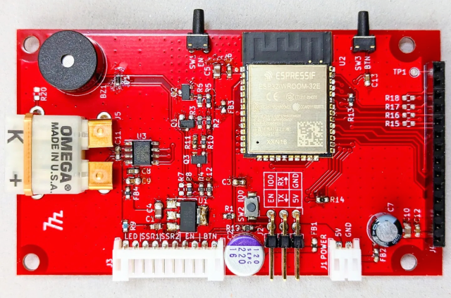
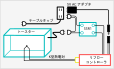
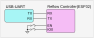
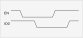

# トースターリフローコントローラ : ハードウェア

> __Warning__
>
> 内容には当方がおこなった「家電の改造行為」が含まれています、実際の改造はすべて各自の責任においておこなってください。
>
> 何がおきても当方は一切責任を負いません。
>
> リフローしたトースターで調理しないでください。
>
> 健康被害が発生するおそれがあります。

## トースターの改造

サーモスタットをバイパスする。あるいは浮かして動作しないようにする。

## コントローラ基板

[回路図](./reflow_schematic.pdf)

## 部品表

[部品表](./reflow_BOM.pdf)

## 実装イメージ

## 構成イメージ

## ファームウェア書き込み治具

書き込みのためのボタン押下シーケンス。

もしかしたらこれを使えば自動書き込みできるかも。

* [ESP32 ダウンローダキット](https://akizukidenshi.com/catalog/g/gM-17240/)

ただし、このキットは電源の出力が3.3Vなので、そのあたりの処理は別途必要になると思います。

