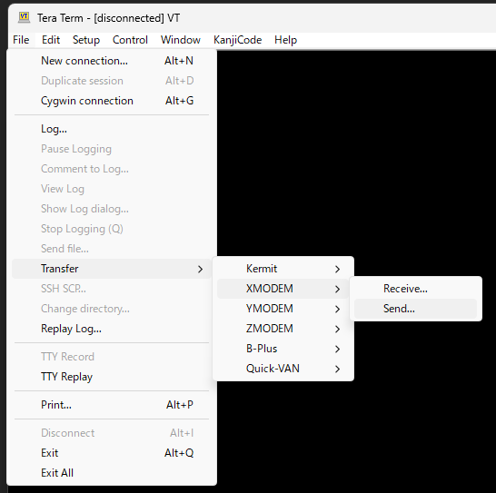

# トースターリフローコントローラ : ソフトウェア

> __Warning__
>
> 内容には当方がおこなった「家電の改造行為」が含まれています、実際の改造はすべて各自の責任においておこなってください。
>
> 何がおきても当方は一切責任を負いません。
>
> リフローしたトースターで調理しないでください。
>
> 健康被害が発生するおそれがあります。

## 必要なもの
* [Arduino IDE](https://www.arduino.cc/en/software)
* [Arduino core for ESP32](https://github.com/espressif/arduino-esp32)
* [Ucglib](https://github.com/olikraus/Ucglib_Arduino)
* [ArduinoJson](https://github.com/bblanchon/ArduinoJson)

## 使い方
初回起動時、SPIFFSをフォーマットするため、初期化に1分程度かかかります。

2回目以降は数秒程度となります。

SW3を長押しすることで動作モードを変更できます。

SW3を離したら動作モードは確定されます。

| 項番 | 押し時間[sec] | 動作モード |
| :---: | :---: | --- |
| 1 | 0 ~ 3 | [リフロー](#1-リフロー) |
| 2 | 3 ~ 6 | [設定ファイル更新](#2-設定ファイル更新) |
| 3 | 6 ~ 9 | [トースターの温度特性の測定](#3-トースターの温度特性の測定) |
| 4 | 9 <   | 項番1に戻る |

### 1. リフロー
設定ファイルの値に従って、温度を調整していきます。

250℃を超えるとSSR(ヒーター)を強制的にOFFします。

リフロー中、SW3を押すと強制停止します。

### 2. 設定ファイル更新

COMポート設定は[こちら](#4-COMポート設定)を参照してください。

設定ファイルは[JSON](#21-jsonファイル)形式となります。

XMODEMプロトコルで設定を受信します。

エラー処理はほとんど入れていないので、通信エラーにはほとんど対応できていません。

また、JSONファイルのフォーマットには気を付けてください。

[TeraTerm Pro](https://ja.osdn.net/projects/ttssh2/) などから、XMODEMでファイルを送信してください。



### 2.1 JSONファイル

JSONファイル例：

```json
{
"Kp":1.85,
"Ki":0.02855,
"Kd":21.08718,
"Sequence":[[145,15], //145℃を超えたら15秒間キープ
            [152,15], //152℃を超えたら15秒間キープ
            [160,10], //160℃を超えたら10秒間キープ
            [165,10], //165℃を超えたら10秒間キープ
            [170,10], //170℃を超えたら10秒間キープ
            [250,20]] //250℃を超えたら10秒間キープ
}
```

### 3. トースターの温度特性の測定

COMポート設定は[こちら](#4-comポート設定)を参照してください。

1秒ごとに測定した温度が出力されます。

250℃を超えるとSSR(ヒーター)を強制的にOFFします。

シリアルポートから出力されるデータはCSV形式になっています。

TeraTerm Proなどを使ってログを保存してください。

ExcelやLibreOfficeなどでグラフ化しPIDのパラメータを求めます。

PIDのパラメータの求め方はこちらから。

* PIDのパラメータ設定方法 : [PID_Param.md](./PID_Param.md)

### 4 COMポート設定

| 項目 | 設定値 |
| --- | --- |
| Baud rate | 115200 |
| Data | 8 bit |
| Parity | none |
| Stop bit | 1 bit |
| Flow Ctrl | none |
